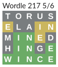

# Share Wordle in Slack

- Go play the real Wordle [here](https://www.powerlanguage.co.uk/wordle/)
- Use this project [here](https://stringham.me/share-wordle)

This is a fork of [hannahcode's Wordle Clone](https://github.com/hannahcode/wordle) that I simplified to be able to enter your wordle grid and share it.

You can get the slack emoji for this project [here](public/slack-wordle.zip).

Sharing your solution in slack will look something like this:

